# AI Content Generator Full-Stack Application

## Overview

The **AI Content Generator** is a full-stack web application designed to assist users in generating various types of content using artificial intelligence. Built with modern web technologies, it offers a user-friendly interface and a robust backend to handle content generation efficiently.

## Features

- **User Authentication**: Secure login and registration system to manage user access.
- **Content Generation**: Utilize AI models to create diverse content types, including:
  - Blog posts
  - Social media captions
  - Product descriptions
  - Code snippets
- **History Tracking**: Maintain a record of all generated content for easy access and management.
- **Responsive Design**: Optimized for both desktop and mobile devices.

## Technologies Used

- **Frontend**: Next.js, React, Tailwind CSS
- **Backend**: Node.js, Express.js
- **Database**: PostgreSQL with Drizzle ORM
- **Authentication**: Clerk for user management
- **AI Integration**: OpenAI's GPT models

### **Screenshots**
Below are some screenshots demonstrating the application’s features.

#### **Blog Content Generator**
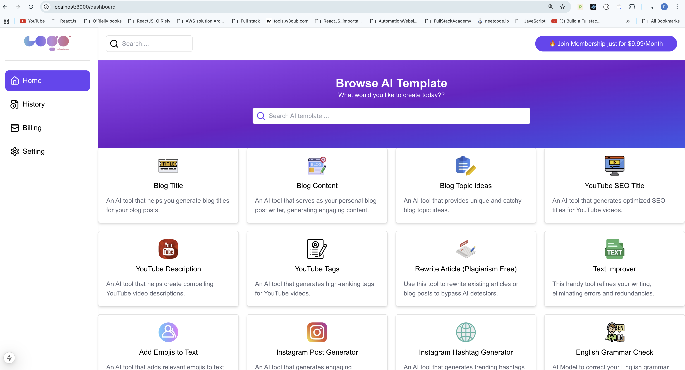

#### **Blog Content Generator**
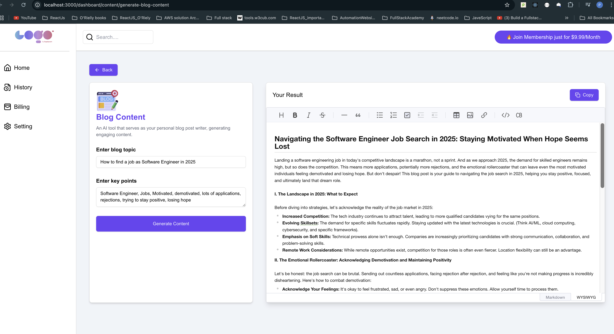

#### **Game Character Generator**
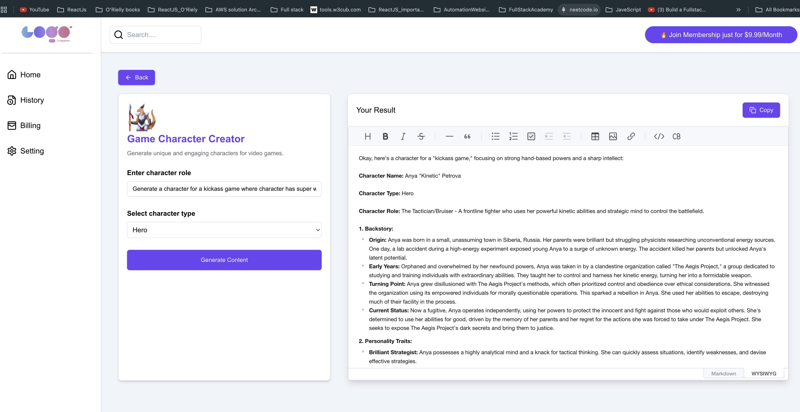

#### **Instagram Hashtag Generator**
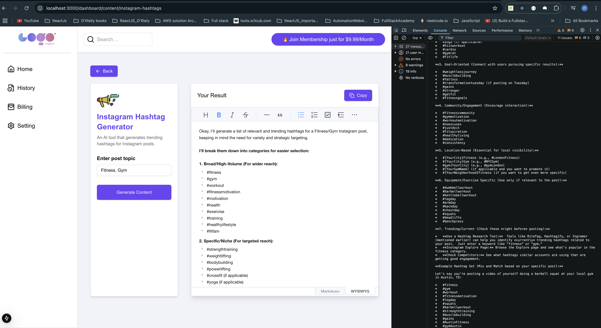

#### **Instagram Post Generator**
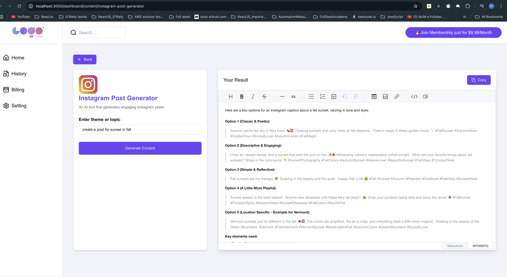

#### **JavaScript to Java Converter**
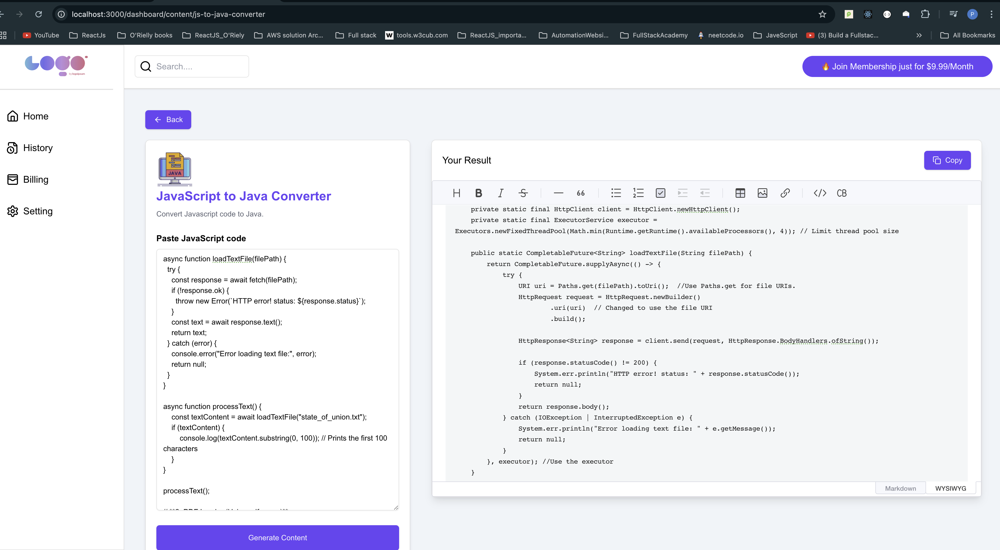

#### **JavaScript to Python Converter**


#### **Medium Blog Post Generator**
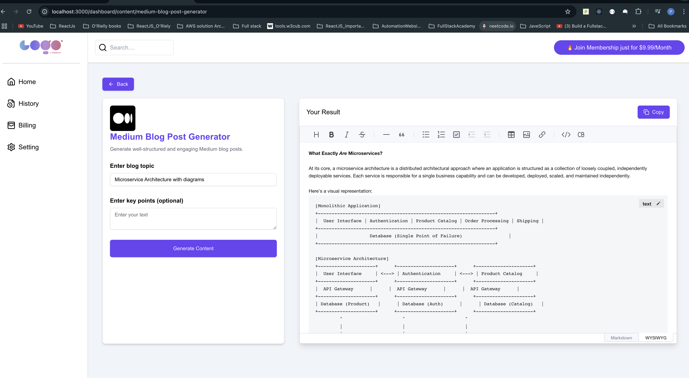

#### **Python to JavaScript Converter**
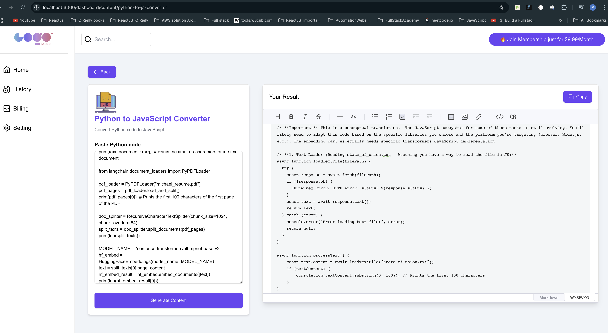

#### **Quote Generator (English)**
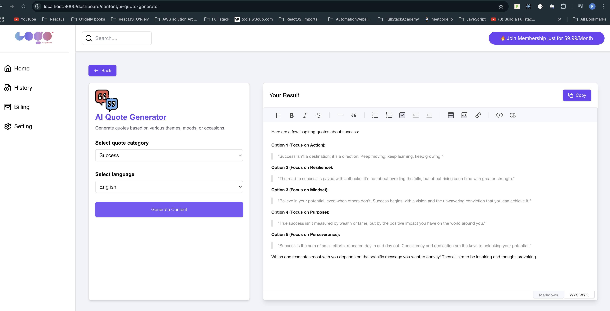

#### **Quote Generator (Gujarati)**
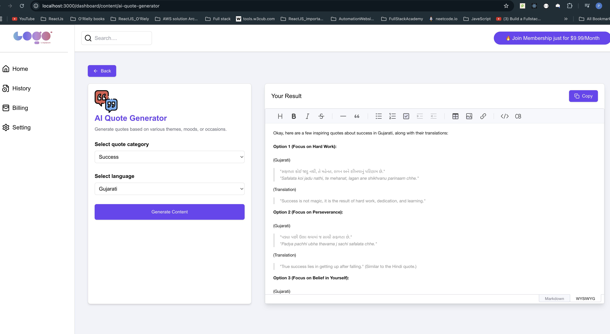

#### **Quote Generator (Hindi)**
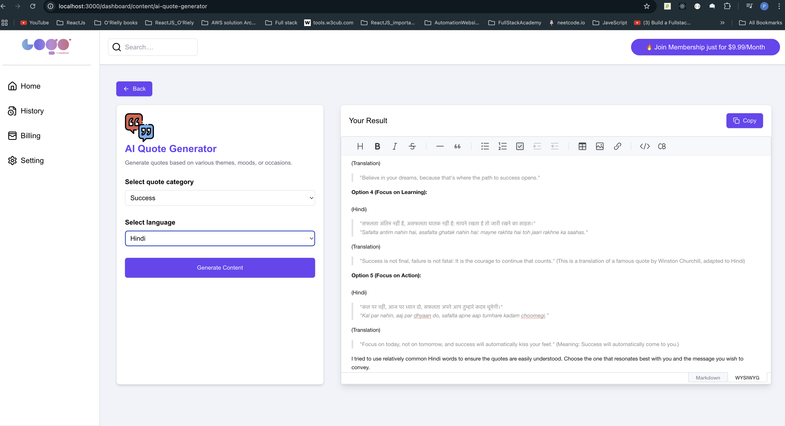

#### **Recipe Generator**
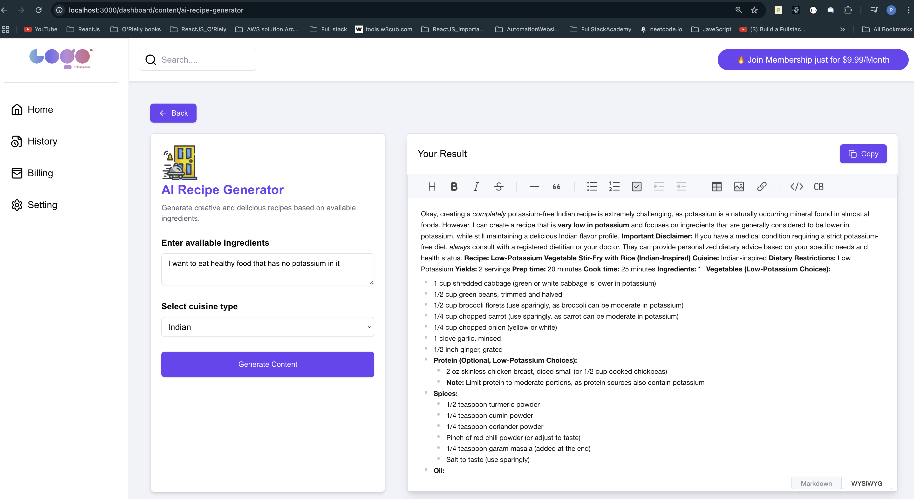

#### **Restaurant Finder**


#### **Startup Business Idea Generator**
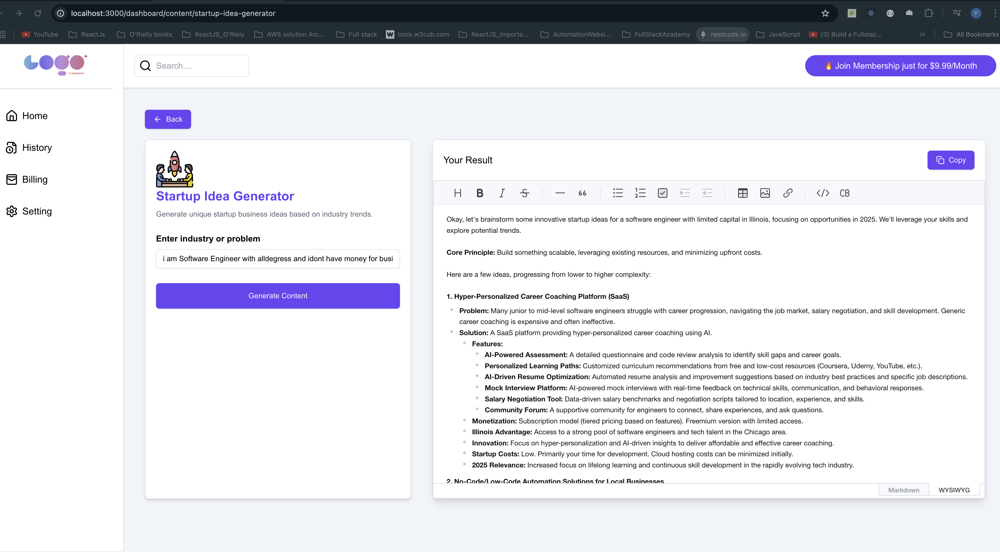

#### **Text Improver**
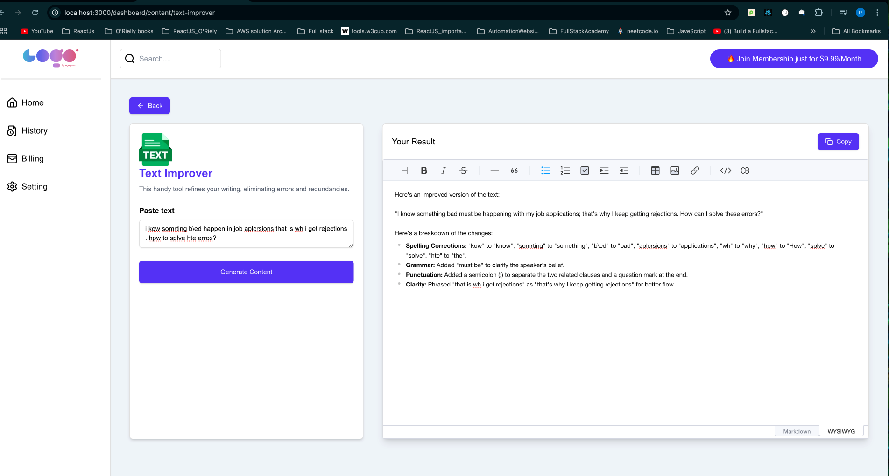

#### **Token Usage Bar**
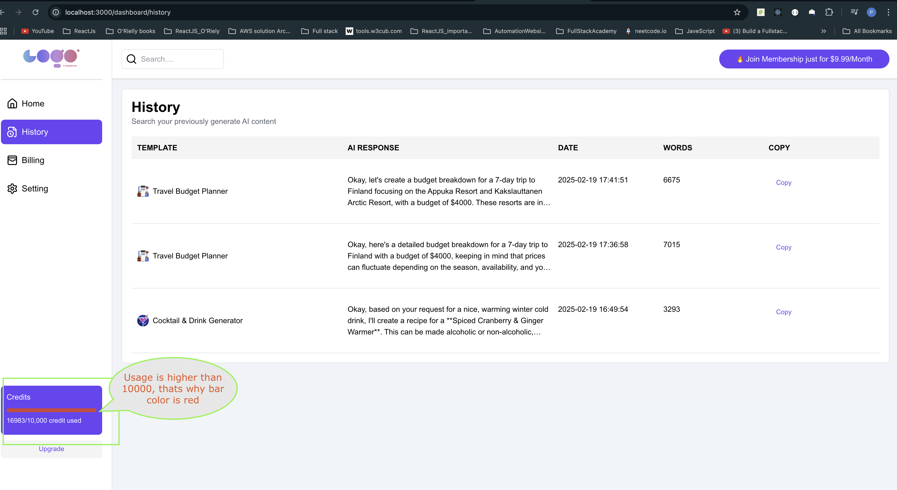

#### **Travel Itinerary Generator**


#### **Travel Feature**
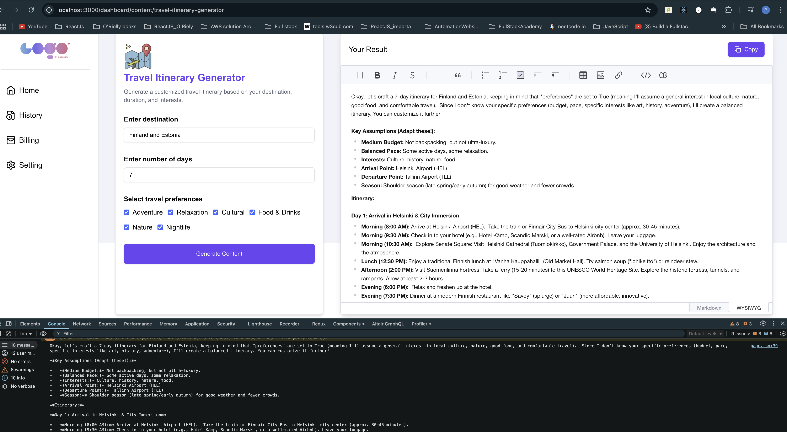

## Getting Started

### Prerequisites

- Node.js (v14 or higher)
- PostgreSQL database
- OpenAI API key
- Clerk account for authentication

### Installation

1. **Clone the Repository**:

   ```bash
   git clone https://github.com/PatelPratik39/AI-Content-Generator_Full-Stack.git
   cd AI-Content-Generator_Full-Stack
   ```

2. **Install Dependencies**:

   ```bash
   npm install
   ```

3. **Set Up Environment Variables**:

   Create a `.env` file in the root directory and add the following:

   ```env
   DATABASE_URL=your_postgresql_database_url
   OPENAI_API_KEY=your_openai_api_key
   CLERK_API_KEY=your_clerk_api_key
   ```

4. **Run Database Migrations**:

   ```bash
   npx drizzle-kit up
   ```

5. **Start the Development Server**:

   ```bash
   npm run dev
   ```

   The application should now be running on `http://localhost:3000`.

## Usage

- **Register/Login**: Create an account or log in using your credentials.
- **Generate Content**: Navigate to the content generation section, select the desired template, and input the necessary details.
- **View History**: Access your generated content history from the dashboard sidebar.


*Note: This README provides a general overview of the project. For detailed information, please refer to the project's documentation or source code.*
